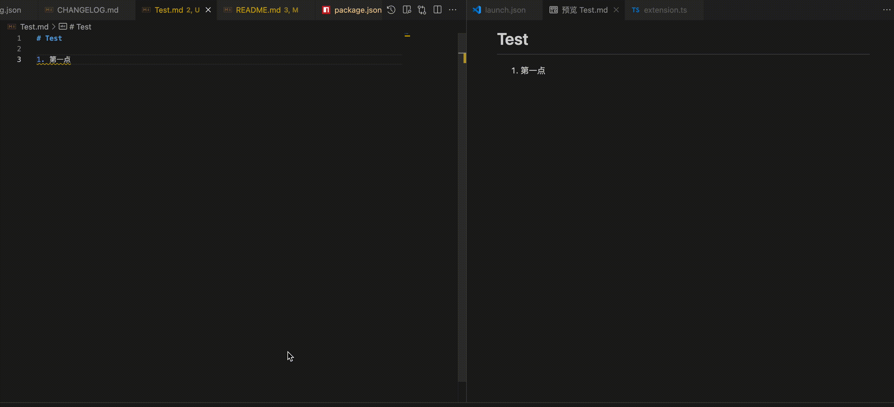
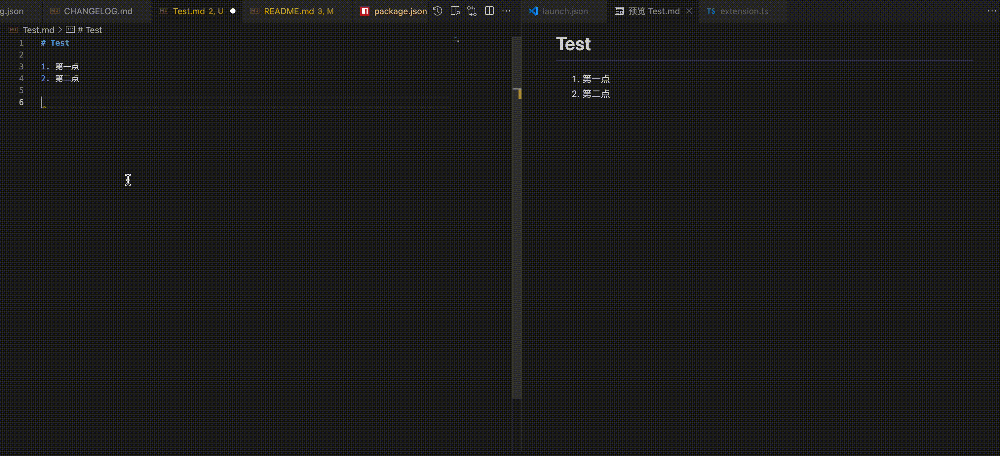
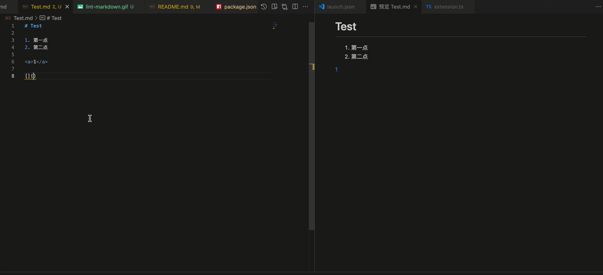

# Doc Tools

本插件提供文档[静态检查](#静态检查)、[预览、目录生成等工具](#其它工具)，希望能提高文档贡献过程中开发体验。

[开发指南](./README_develop.md)

[CHANGELOG](./CHANGELOG.md)

## 静态检查

| 名称                                                  | 功能                                                                            |
| ----------------------------------------------------- | ------------------------------------------------------------------------------ |
| [Markdown Lint](#markdown-lint)                       | Markdown 语法检查                                                               |
| [Tag Closed Check](#tag-closed-check)                 | Html 标签闭合检查                                                               |
| [Link Validity Check](#link-validity-check)           | 链接有效性检查（包含：1. 内链；2. 外链）                                          |
| [Resource Existence Check](#resource-existence-check) | 资源是否存在检查（包含：1. 内链；2. 外链）                                        |
| [Toc Check](#toc-check)                               | 目录文件检查（1. 目录中引用的文件需要存在；2. 每一篇 md 文档都需要在目录中进行维护）  |
| [CodeSpell Check](#codespell-check)                   | 单词拼写检查                                                                    |
| [Filename Check](#filename-check)                     | Markdown 文件名称检查（包含：1. 文件名称是否命名规范，2. 中英文文档名称是否一致）    |
| [Punctuation Check](#punctuation-check)               | 标点符号检查                                                                    |

### 全局配置说明

插件支持以下配置项（可在 VSCode 设置中搜索 `docTools.scope` 或通过 `settings.json` 进行配置）：

- `docTools.scope`
  - 类型：`boolean`
  - 说明：是否检查范围仅限于 `docs/zh` 和 `docs/en` 目录
  - 默认：`false`

#### 全局配置示例

```json
{
  "docTools.scope": false // 启用检查范围仅限于 docs/zh 和 docs/en 目录，默认检查项目全局文档
}
```

### Markdown Lint

基于 `Markdownlint` 实现，帮助用户规范 Markdown 文档格式。



#### 功能介绍

- 自动检测 Markdown 文件中的格式问题，如标题格式、列表缩进、空行等；
- 检查结果以警告（Warning）的形式在编辑器中高亮显示，并可在“问题”面板中查看详细信息；
- 可通过配置项灵活启用或禁用 lint 功能，并支持自定义 lint 规则，满足不同团队或个人的文档规范需求；
- 支持一键修复功能，帮助用户一键修复所有 Markdownlint 问题。

#### 使用方法

1. 安装并启用本插件，打开 Markdown 文件（`.md`），插件会自动对文件内容进行 lint 检查；
2. 检查结果会以警告（Warning）的形式显示在编辑器左侧和底部问题面板；
3. 将光标悬停在警告标记上可查看详细的规则说明和建议；
4. 可通过 VSCode 提供的 Quick Fix（快速修复）功能，点击灯泡图标或按下快捷键（通常为 `Cmd+.` 或 `Ctrl+.`），一键修复所有 Markdownlint 问题。

#### 配置说明

插件支持以下配置项（可在 VSCode 设置中搜索 `docTools.markdownlint`或通过`settings.json`进行配置）：

- `docTools.markdownlint.enable`
  - 类型：`boolean`
  - 说明：是否启用 Markdown lint 功能
  - 默认：`true`

- `docTools.markdownlint.config`
  - 类型：`object`
  - 说明：自定义 markdownlint 配置对象。若未设置，则使用插件内置的默认规则

##### 配置示例

```json
{
  "docTools.markdownlint.enable": true, // 是否开启功能
  "docTools.markdownlint.config": {
    "MD013": false, // 禁用行长度限制
    "MD041": true // 启用标题必须为一级标题
  }
}
```

#### 默认规则

插件内置一套 Markdownlint 默认规则（见 `config/markdownlint`），可根据实际需求通过配置覆盖。

### Tag Closed Check

检查 Markdown 文件中的 Html 标签是否正确闭合，帮助用户避免因标签未闭合导致的渲染或语法错误。



#### 功能介绍

- 自动检测 Markdown 文件中的 Html 标签是否正确闭合，包括未闭合、嵌套错误等问题；
- 支持快速修复功能，帮助用户一键修正标签闭合和转义问题；
- 支持通过配置项灵活启用或禁用该功能。

#### 使用方法

1. 安装并启用本插件，打开 Markdown 文件（`.md`），插件会自动对文件内容进行 Html 标签闭合检查；
2. 检查结果会以错误（Error）的形式在编辑器中高亮显示，并可在“问题”面板中查看详细信息；
3. 将光标悬停在错误标记处，可查看错误详情；
4. 可通过 VSCode 提供的 Quick Fix（快速修复）功能，点击灯泡图标或按下快捷键（通常为 `Cmd+.` 或 `Ctrl+.`），一键修复标签问题。

PS：在嵌套的 Html 标签（如 \<table>xxx\</table> 这种情况）里引发提示，请使用`&lt;和&gt;字符替换 (适用于 Html 标签嵌套的情况)`进行修复，其它情况请使用`\字符替换 (适用于非 Html 标签嵌套的情况)`进行修复。

#### 配置说明

插件支持以下配置项（可在 VSCode 设置中搜索 `docTools.check.tagClosed`或通过`settings.json`进行配置）：

- `docTools.check.tagClosed.enable`
  - 类型：`boolean`
  - 说明：是否启用 Html 标签闭合检查

##### 配置示例

```json
{
  "docTools.check.tagClosed.enable": true
}
```

#### 快速修复说明

- \字符替换：适用于非 Html 标签嵌套的情况，会在对应的 Html 标签前加上 `\` 转义字符；
- \&lt;和\&gt;字符替换：适用于 Html 标签嵌套的情况，会将 `<` 和 `>` 替换为 `&lt;` 和 `&gt;`；
- 闭合标签：自动为未闭合的标签补全闭合部分。

### Link Validity Check

该插件用于在 VSCode 中检查 Markdown 文档中的链接有效性，帮助用户及时发现失效或错误的链接，提升文档质量。



#### 功能介绍

- 自动扫描 Markdown 文档中的所有链接，包括以下三种格式：
  - `[文本](链接)` 形式的标准 Markdown 链接
  - `<http://example.com>` 形式的裸链接
  - `<a href="链接">` 形式的 Html 链接
- 链接为 http 链接，支持跳过锚点链接（如 `#section`），并自动忽略链接中的锚点部分，仅校验主链接地址；
- 链接为相对路径的 `.md` 链接时，支持检测本地的 `.md` 文件是否存在，并且能够检查锚点是否有效；
- 对于无效链接，会在编辑器中以错误（Error）的形式在编辑器中高亮显示，并在问题面板中给出详细提示；
- 对于访问超时的链接，会在编辑器中以警告（Warning）的形式在编辑器中高亮显示，并在问题面板中给出详细提示；
- 支持通过配置项灵活启用或禁用该功能；
- 支持添加链接检查白名单（仅在链接为 http 链接会出现此修复功能）。

#### 使用方法

1. 安装并启用插件后，打开任意 Markdown 文件（`.md`），插件会自动检测所有链接的有效性；
2. 检查结果会以错误（Error）或警告（Warning）的形式显示在编辑器左侧和底部问题面板；
3. 将光标悬停在错误或警告标记处，可查看错误详情；
4. 若 http 链接确认可访问存在误报的情况，可通过 Quick Fix（快速修复）功能，将链接加入检查白名单。

#### 配置说明

插件支持以下配置项（可在 VSCode 设置中搜索 `docTools.check.linkValidity`或通过`settings.json`进行配置）：

- `docTools.check.linkValidity.enable`
  - 类型：`boolean`
  - 说明：是否启用链接有效性检查
  - 默认：`true`

- `docTools.check.linkValidity.only404.enable`
  - 类型：`boolean`
  - 说明：启用链接有效性检查只在链接无法访问时提示（可减少一些误报）
  - 默认：`true`

- `docTools.check.url.whiteList`
  - 类型：`array`
  - 说明：检测链接白名单（添加后忽略对该链接的检查）
  - 默认：`[]`

##### 配置示例

```json
{
  "docTools.check.linkValidity.enable": true,
  "docTools.check.linkValidity.only404.enable": true,
  "docTools.check.url.whiteList": []
}
```

#### 注意事项

- 默认开启`链接有效性检查只在链接无法访问时提示`配置，可自由关闭此配置；
- 插件仅检测链接的格式和可达性，不保证目标内容的正确性；
- 某些私有或受限网络下的链接可能因网络原因被误判为无效；
- 对于本地文件链接，需确保路径正确且文件存在。

### Resource Existence Check

检查 Markdown 文件中的资源链接（如图片、视频等）是否存在，帮助用户及时发现无效或丢失的资源引用。

#### 功能介绍

- 自动检测 Markdown 文件中的图片、视频等资源链接是否有效，包括 Markdown 语法和 Html 标签（如 ``、`<image>`、`<video>`）中的资源路径；
- 支持多种资源引用方式，全面覆盖常见的资源链接格式；
- 对于无效或不存在的资源链接，会在编辑器中以错误（Error）形式提示用户，并在“问题”面板中列出详细信息；
- 对于访问超时的资源链接，会在编辑器中以警告（Warning）形式提示用户，并在“问题”面板中列出详细信息；
- 支持通过配置项灵活启用或禁用该功能；
- 支持添加链接检查白名单（仅在链接为 http 链接会出现此修复功能）。

#### 使用方法

1. 安装并启用本插件，打开 Markdown 文件（`.md`），插件会自动检查文档中的资源链接有效性；
2. 检查结果会以错误（Error）或警告（Warning）的形式在编辑器中高亮显示，并可在“问题”面板中查看详细信息；
3. 将光标悬停在错误或警告标记处，可查看无效资源的具体路径和提示信息；
4. 若 http 资源链接确认可访问存在误报的情况，可通过 Quick Fix（快速修复）功能，将链接加入检查白名单。

#### 配置说明

插件支持以下配置项（可在 VSCode 设置中搜索 `docTools.check.resourceExistence` 或通过 `settings.json` 进行配置）：

- `docTools.check.resourceExistence.enable`
  - 类型：`boolean`
  - 说明：是否启用资源存在性检查
  - 默认：`true`

- `docTools.check.resourceExistence.only404.enable`
  - 类型：`boolean`
  - 说明：启用资源是否存在检查只在资源无法访问时提示（可减少一些误报）
  - 默认：`true`

- `docTools.check.url.whiteList`
  - 类型：`array`
  - 说明：检测链接白名单（添加后忽略对该链接的检查）
  - 默认：`[]`

##### 配置示例

```json
{
  "docTools.check.resourceExistence.enable": true,
  "docTools.check.resourceExistence.only404.enable": true,
  "docTools.check.url.whiteList": []
}
```

### Toc Check

检查目录中链接的有效性，同时将检查每一篇文档是否已被包含在任意上级目录的 `_toc.yaml` 目录结构中，帮助用户及时发现和修正文档目录结构中的问题。

#### 功能介绍

- 自动解析 TOC（目录）YAML 文件，递归收集所有链接（如 `href`、`upstream`），检查每个链接是否有效（即对应的文档是否存在于项目中）；
- 自动检测当前打开的 Markdown 文档是否已被加入到项目的 `_toc.yaml` 目录结构中。

#### 使用方法

1. 安装并启用本插件，打开包含 TOC 的 YAML 文件（如 `toc.yaml`），插件会自动对文件内容进行有效性检查以及该文件是否已被包含在当前目录或任意上级目录的 `_toc.yaml` 文件中；
2. 检查结果会以错误（Error）的形式在编辑器中高亮显示，并可在“问题”面板中查看详细信息，同时，若文档未被目录包含，编辑器右下角会弹出提示信息，提醒用户将该文件加入 `_toc.yaml`；
3. 将光标悬停在错误标记处，可查看错误详情。

#### 配置说明

插件支持以下配置项（可在 VSCode 设置中搜索 `docTools.check.toc` 或通过 `settings.json` 进行配置）：

- `docTools.check.toc.enable`
  - 类型：`boolean`
  - 说明：是否启用 TOC 校验功能
  - 默认：`true`

##### 配置示例

```json
{
  "docTools.check.toc.enable": true
}
```

### CodeSpell Check

该插件用于在 VSCode 中检查 Markdown 文档中的单词拼写，帮助用户及时发现拼写错误，提升文档质量。

#### 功能介绍

- 自动扫描 Markdown 文档中的文本内容，检测是否存在拼写错误的英文单词；
- 对于拼写错误的单词，会在编辑器中以提示（Info）的形式高亮显示，并在问题面板中给出详细提示；
- 支持通过配置项灵活启用或禁用该功能；
- 支持单词修正功能，用户可以根据提示选择正确的单词进行修正；
- 支持自定义忽略单词列表，用户可将特定单词加入白名单以避免误报。

#### 使用方法

1. 安装并启用插件后，打开任意 Markdown 文件（`.md`），插件会自动检测文档中的单词拼写；
2. 检查结果会以提示（Info）的形式在编辑器中高亮显示和在底部问题面板显示；
3. 将光标悬停在提示标记处，可查看拼写错误详情；
4. 可通过 Quick Fix（快速修复）功能，可以选择候选单词进行修改，或将拼写错误的单词添加到忽略列表。

#### 配置说明

插件支持以下配置项（可在 VSCode 设置中搜索 `docTools.check.codespell` 或通过 `settings.json` 进行配置）：

- `docTools.check.codespell.enable`
  - 类型：`boolean`
  - 说明：是否启用单词拼写检查
  - 默认：`true`

- `docTools.check.codespell.whiteList`
  - 类型：`array`
  - 说明：单词白名单（添加后忽略对该单词的检查）
  - 默认：`[]`

##### 配置示例

```json
{
  "docTools.check.codespell.enable": true,
  "docTools.check.codespell.whiteList": ["xxx"]
}
```

#### 注意事项

- 插件主要检测英文单词拼写，对于中文等非拉丁文字符可能不适用；
- 某些专业术语或专有名词可能被误判为拼写错误，建议将其添加到忽略列表；
- 插件依赖于内置词典进行拼写检查，可能无法覆盖所有专业领域词汇。

### Filename Check

检查 Markdown 文件名/目录名的是否符合命名规范，检查中英文文档名称一致性，帮助用户确保文件命/目录名符合规范要求和中英文文档名称一致性，提升文档管理质量。

#### 功能介绍

- 支持检查 Markdown 文件名/目录名是否符合规范要求：需英文字母小写并且使用下划线连接单词；
- 对于不符合规范的文件名，会在 Markdown 文件打开时，右下角弹出提示；
- 支持检查中英文文档文件名是否一致，确保中英文文档一一对应；
- 当中英文文档文件名不一致时，会在 Markdown 文件打开时，右下角弹出提示；
- 支持通过配置项灵活启用或禁用相关功能；

#### 使用方法

1. 安装并启用插件后，在设置中勾选启用相关功能；
2. 打开 Markdown 文件后，若文件名不符合规范或中英文文档文件名不一致，右下角会弹出提示。

#### 配置说明

插件支持以下配置项（可在 VSCode 设置中搜索 `docTools.check.name` 或通过 `settings.json` 进行配置）：

- `docTools.check.name.enable`
  - 类型：`boolean`
  - 说明：是否启用文件/目录命名规范检查
  - 默认：`false`

- `docTools.check.name.whiteList`
  - 类型：`array`
  - 说明：文件/目录命名规范白名单（添加后忽略对该名称的检查）
  - 默认：`[]`

- `docTools.check.nameConsistency.enable`
  - 类型：`boolean`
  - 说明：是否启用中英文文档名称一致性检查
  - 默认：`false`

##### 配置示例

```json
{
  "docTools.check.name.enable": true,
  "docTools.check.name.whiteList": ["README.md", "README_en.md"],
  "docTools.check.nameConsistency.enable": true
}
```

#### 注意事项

- 检查默认关闭，如需要相关功能请到设置中开启

### Punctuation Check

检查 Markdown 文档中的标点符号使用规范，帮助用户发现并纠正标点符号使用不当的问题，提升文档内容质量。

#### 功能介绍

- 自动扫描 Markdown 文档中的文本内容，检测标点符号使用是否规范；
- 支持检查中英文标点符号混用问题，如中文文本中使用英文标点或英文文本中使用中文标点；
- 支持检查中文标点符号前后空格使用规范，中文标点前后不应有空格；
- 支持检查标点符号是否存在连续使用的情况；
- 支持检查手册/指南链接是否被书名号包裹；
- 对于不规范的标点符号使用，会在编辑器中以提示（Info）的形式高亮显示，并在问题面板中给出详细提示；
- 支持通过配置项灵活启用或禁用相关功能。

#### 使用方法

1. 安装并启用插件后，在设置中勾选启用相关功能；
2. 打开任意 Markdown 文件（`.md`），插件会自动检测文档中的标点符号使用情况；
3. 检查结果会以提示（Info）的形式在编辑器中高亮显示和在底部问题面板显示；
4. 将光标悬停在提示标记处，可查看标点符号使用不规范的详情。

#### 配置说明

插件支持以下配置项（可在 VSCode 设置中搜索 `docTools.check.punctuation` 或通过 `settings.json` 进行配置）：

- `docTools.check.punctuationBlankSpace.enable`
  - 类型：`boolean`
  - 说明：启用标点符号前后无空格检查
  - 默认：`false`

- `docTools.check.punctuationMixing.enable`
  - 类型：`boolean`
  - 说明：启用中英文标点符号混用检查
  - 默认：`false`

- `docTools.check.punctuationConsecutive.enable`
  - 类型：`boolean`
  - 说明：启用连续标点符号检查
  - 默认：`false`

- `docTools.check.punctuationManualLink.enable`
  - 类型：`boolean`
  - 说明：启用手册/指南链接是否被书名号包裹检查
  - 默认：`false`

##### 配置示例

```json
{
  "docTools.check.punctuationBlankSpace.enable": true,
  "docTools.check.punctuationMixing.enable": true,
  "docTools.check.punctuationConsecutive.enable": true,
  "docTools.check.punctuationManualLink.enable": true
}
```

#### 注意事项

- 检查默认关闭，如需要相关功能请到设置中开启；
- 因语句含义复杂，存在误报的情况。

## 其它工具

| 名称                | 功能                             |
| ------------------- | -------------------------------- |
| [预览 Markdown](#预览-markdown) | 可预览 openEuler 文档风格的页面 |
| [生成手册 _toc.yaml](#生成手册-toc-yaml) | 根据选中目录生成 _toc.yaml 文件 |
| [生成链接锚点并复制](#生成链接锚点并复制) | 将选中内容生成链接锚点并复制 |
| [批量检查链接可访问性](#批量检查链接可访问性) | 批量检查选中目录下所有 Markdown 和 _toc.yaml 涉及链接的可访问性 |
| [批量检查目录和文件是否符合命名规范](#批量检查目录和文件是否符合命名规范) | 批量检查选中目录下的文件和子目录名字是否符合命名规范 |
| [批量检查中英文文档名称一致性](#批量检查中英文文档名称一致性) | 批量检查选中目录下 Markdown 中英文文档名称是否一致 |
| [批量检查 _toc.yaml](#批量检查-toc-yaml) | 批量检查选中目录下的 _toc.yaml 文件是否有错误 |
| [批量检查 Html 标签闭合](#批量检查-html-标签闭合) | 批量检查选中目录下的 Markdown 文件中的 Html 标签闭合情况 |


### 预览 Markdown

#### 功能介绍

- 支持将某一本手册的 Markdown 预览成 openEuler 文档风格的页面；
- 支持保存后刷新预览页面；
- 支持从预览页面打开对应的 Markdown 文件或 _toc.yaml 文件。

#### 使用方法

1. 打开 Markdown 文件；
2. 在编辑器右上角点击 `D` 字图标打开预览页面；
3. 修改保存 Markdown 文件后会刷新预览页面；
4. 修改关联的 _toc.yaml 文件后会刷新预览页面。

#### 注意事项

- 只支持手册级别的预览；
- 如果预览的 Markdown 文件没有加入 _toc.yaml 文件，则不会显示菜单。

### 生成手册 _toc.yaml

#### 功能介绍

- 自动生成目录：根据实际存在的 Markdown 文件，自动生成 _toc.yaml，避免手动维护目录结构；
- 同步标题：自动读取每个 Markdown 文件的一级标题（# ），作为目录项的 label；
- 去除无效项：如果 _toc.yaml 中的某些 href 指向的文件不存在，会自动移除这些无效项。

#### 使用方法

1. 安装并启用本插件；
2. 右键点击对应目录：选择菜单`Doc Tools`，再选择`生成手册 _toc.yaml`选项，便会在目标目录下自动生成或更新`_toc.yaml`。

#### 注意事项

- 只有带有一级标题（# 标题）的 Markdown 文件才会被收录；

### 生成链接锚点并复制

#### 功能介绍

- 将选中的文本生成锚点并复制到剪贴板，方便后续使用。

#### 使用方法

1. 安装并启用本插件；
2. 打开任意 Markdown 文件（`.md`）；
3. 选中标题文本；
4. 右击编辑区域；
5. 选择菜单`Doc Tools`，再选择`生成链接锚点并复制`选项。

#### 注意事项

- 生成的锚点适用于 Vitepress 页面的锚点跳转；
- 通常情况下和大多数 Markdown 预览（如 vscode 编辑器自带的 Markdown 预览）的锚点跳转一致，但在内容有一些符号的情况下存在一些差异，可能导致锚点在非 Vitepress 构建出的页面下不能跳转。

### 批量检查链接可访问性

#### 功能介绍

- 检测选中目录下的 Markdown 文档和 _toc.yaml 中的所有链接是否可以正常访问；
- 通过页面的方式呈现检测结果。

#### 使用方法

1. 安装并启用本插件；
2. 右键点击对应目录：选择菜单`Doc Tools`，再选择`批量检测链接可访问性`选项；
3. 在打开的页面勾选配置，点击`开始检查`。

#### 注意事项

- 某些私有或受限网络下的链接可能因网络原因被误判为无效，请以实际访问为准；

### 批量检查目录和文件是否符合命名规范

#### 功能介绍

- 支持批量检查选中目录下所有文件和子目录的命名规范：英文字母小写并使用下划线连接单词；
- 通过页面形式呈现检查结果，方便用户处理命名不规范的文件。

#### 使用方法

1. 安装并启用本插件；
2. 在资源管理器中右键点击需要检查的目录；
3. 选择菜单`Doc Tools`，再选择`批量检查目录和文件是否符合命名规范`选项；
4. 在打开的页面中查看检查结果，了解哪些文件或目录命名不规范；
5. 根据提示信息修改不符合规范的文件名或目录名。

#### 注意事项

- 批量检查会遍历选中目录下的所有文件和子目录，可能需要一些处理时间；
- 修改文件名或目录名后请同步更改其他文档中的相关链接。

### 批量检查中英文文档名称一致性

#### 功能介绍

- 支持批量检查选中目录下中英文文档的文件名一致性；
- 通过页面的方式呈现检查结果，清晰展示缺少对应语言版本的文档。

#### 使用方法

1. 安装并启用本插件；
2. 在资源管理器中右键点击需要检查的目录；
3. 选择菜单`Doc Tools`，再选择`批量检查中英文文档名称一致性`选项；
4. 在打开的页面中查看检查结果，了解哪些文档缺少对应语言版本；
5. 根据提示信息创建缺失的文档或修正不一致的文件名。

#### 注意事项

- 批量检查会遍历选中目录下的所有 Markdown 文件，可能需要一些处理时间；
- 修改文件名后请同步更改其他文档中的相关链接。

### 批量检查 _toc.yaml

#### 功能介绍

- 支持批量检查选中目录下的 _toc.yaml 文件是否有错误；
- 通过页面的方式呈现检查结果，清晰展示 _toc.yaml 文件的错误信息。

#### 使用方法

1. 安装并启用本插件；
2. 在资源管理器中右键点击需要检查的目录；
3. 选择菜单`Doc Tools`，再选择`批量检查 _toc.yaml`选项；
4. 在打开的页面点击`开始检查`。

#### 注意事项

- 批量检查会递归遍历选中目录下的所有 _toc.yaml 文件，可能需要一些处理时间。

### 批量检查 Html 标签闭合

#### 功能介绍

- 支持批量检查选中目录下的 Markdown 文件中的 Html 标签闭合情况；
- 通过页面的方式呈现检查结果，清晰展示错误信息。

#### 使用方法

1. 安装并启用本插件；
2. 在资源管理器中右键点击需要检查的目录；
3. 选择菜单`Doc Tools`，再选择`批量检查 Html 标签闭合`选项；
4. 在打开的页面点击`开始检查`。

#### 注意事项

- 批量检查会递归遍历选中目录下的所有 Markdown 文件，可能需要一些处理时间。
