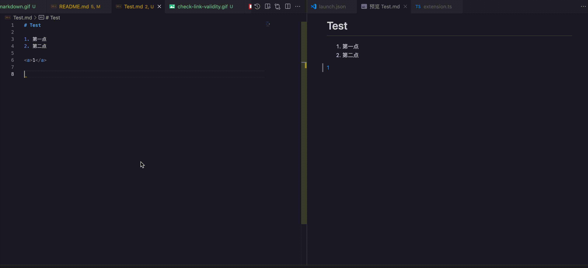

# Doc Tools

## 功能介绍

| 名称                     | 功能                                       | 执行时机                          | 提示级别 | 提示语                             |
| ------------------------ | ------------------------------------------ | --------------------------------- | -------- | ---------------------------------- |
| Markdown Lint            | Markdown 语法检查                          | md 文件打开、保存、停止修改 1s 后 | warning  | 具体的 markdownlint 规则           |
| Tag Closed Check         | 单词拼写检查                               | md 文件打开、保存、停止修改 1s 后 | error    | Unclosed html tag: ${tag}         |
| Link Validity Check      | 链接有效性检查（包含：1. 内链；2. 外链）   | md 文件打开、保存、停止修改 1s 后 | warning  | Invalid link: ${link}              |
| Resource Existence Check | 资源是否存在检查（包含：1. 内链；2. 外链） | md 文件打开、保存、停止修改 1s 后 | warning  | Non-existent resource: ${resource} |
| Toc Check                | 目录文件检查（目录中引用的文件需要存在）   | _toc.yaml 打开、保存、停止修改 1s 后，md 文件打开后会检测是否加入 _toc.yaml | error    | Non-existent doc in toc: ${doc} |
| CodeSpell Check          | 单词拼写检查                               | md 文件打开、保存、停止修改 1s 后 | info     | CodeSpell warning: ${code}          |

## Markdown Lint

1. 自动提示

## Tag Closed Check

1. 自动提示
2. 修复功能

## Link Validity Check

1. 自动提示

## Resource Existence Check

同上

## Toc Check

待新增

## CodeSpell Check

